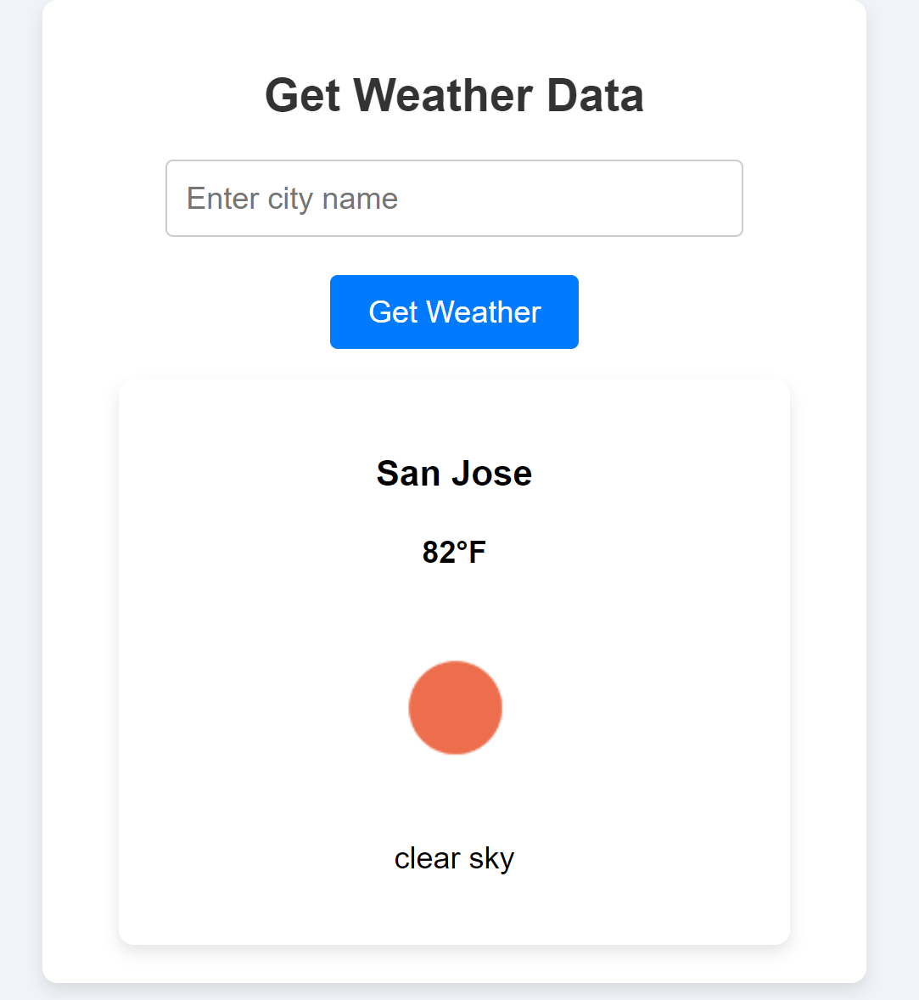

1. go to https://openweathermap.org/api and get an `api key`
1. put the `api key` in the `.env`
    <br>
    example:
    ```env
    WEATHER_API_KEY=38yrg8127y3gr89
    ```
1. navigate to the root of the project and type:
    ```bash
    pipenv install
    ```
1. open http://localhost:5000 and search for a city's weather ⛅ 